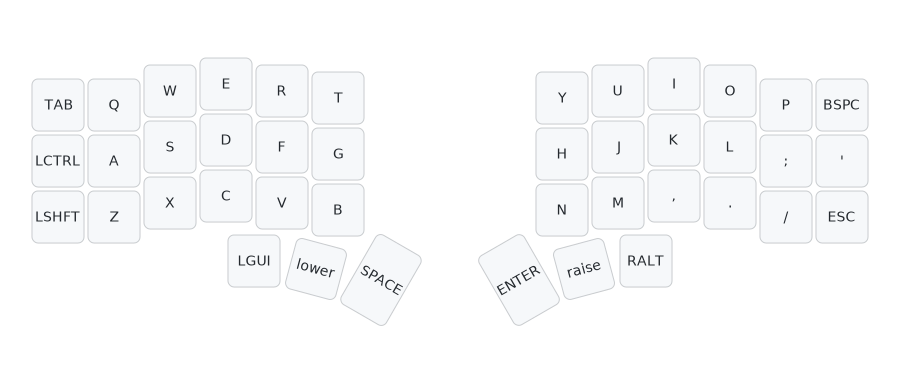
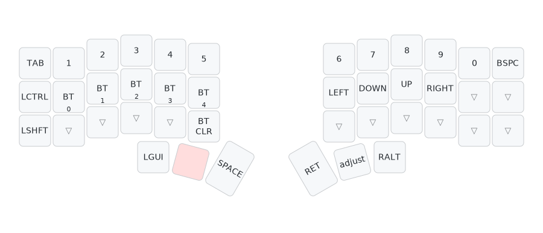
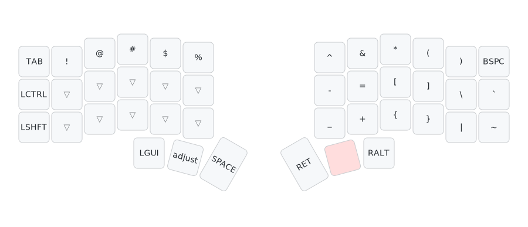
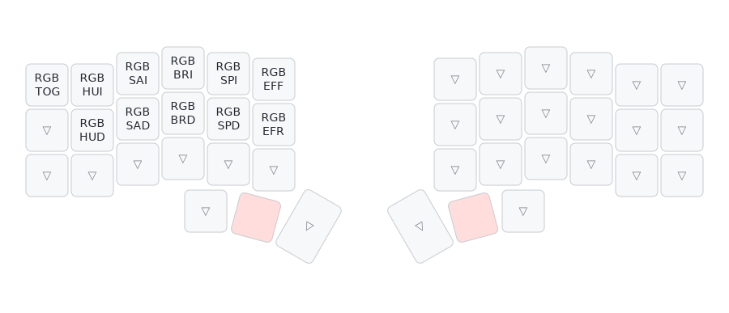

# Corne Keyboard ZMK Config

This repository contains the ZMK configuration for a Corne keyboard with nRF52840 Pro Micro controllers.

## Features

- ZMK Studio support for live keymap editing
- RGB underglow support
- OLED display support
- Bluetooth connectivity
- Deep sleep mode
- GitHub Actions for automatic firmware builds
- Automatic keymap visualization

## Keymap

### Layer 0 - Base (QWERTY)


### Layer 1 - Lower (Numbers & Bluetooth)


### Layer 2 - Raise (Symbols)


### Layer 3 - Adjust (RGB Controls)


## Flashing Instructions

1. Put your keyboard into bootloader mode (double-tap reset button)
2. Download the latest firmware from [GitHub Actions](../../actions) artifacts
3. Copy the `.uf2` files to the keyboard's mass storage device
4. Flash both left (`corne_left-nice_nano_v2-zmk.uf2`) and right (`corne_right-nice_nano_v2-zmk.uf2`) halves

## ZMK Studio

This configuration includes ZMK Studio support for real-time keymap editing:
1. Pair your keyboard via Bluetooth
2. Open [ZMK Studio](https://github.com/zmkfirmware/zmk-studio)
3. Connect to your keyboard
4. Edit your keymap live without reflashing

## Building Locally

```bash
docker run --rm -v $(pwd):/app -w /app zmkfirmware/zmk-build-arm:stable \
  west build -s zmk/app -b nice_nano_v2 -- -DSHIELD=corne_left -DZMK_CONFIG=/app/config
```

## Keymap Visualization

Layout diagrams are automatically generated using [keymap-drawer](https://github.com/caksoylar/keymap-drawer) and updated on every keymap change.